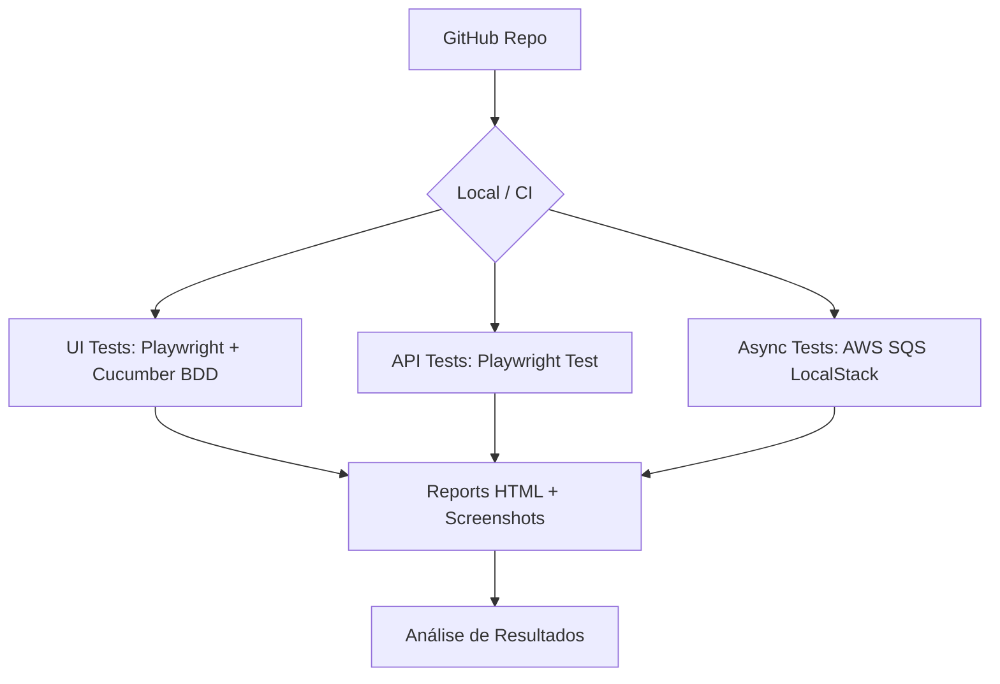

# 🚀 Automação Master Class — Playwright + BDD + SQS + Docker


Projeto de automação de testes de nível profissional utilizando **Playwright**, **Cucumber/BDD** e **Docker**, desenvolvido como Master Class de QA Automation. O projeto cobre testes de API, UI (E2E com checkout completo), validação matemática de regras de negócio e processamento assíncrono via SQS.

---

## 🏗️ Arquitetura do Projeto



---

## 📋 Índice

- [Tecnologias Utilizadas](#-tecnologias-utilizadas)
- [Pré-requisitos](#-pré-requisitos)
- [Instalação e Configuração](#-instalação-e-configuração)
- [Executando os Testes](#-executando-os-testes)
- [Estrutura do Projeto](#-estrutura-do-projeto)
- [Casos de Teste Cobertos](#-casos-de-teste-cobertos)
- [Relatórios de Teste](#-relatórios-de-teste)

---

## 🛠 Tecnologias Utilizadas

| Tecnologia | Versão | Descrição |
|---|---|---|
| **Node.js** | >= 18 | Runtime JavaScript |
| **Playwright** | 1.40.x | Framework de testes E2E e API |
| **Cucumber** | 10.x | BDD com Gherkin em Português |
| **Docker** | - | Containers para infraestrutura |
| **LocalStack** | - | Simulação de AWS SQS local |
| **Jenkins** | - | Pipeline de CI/CD |
| **Axios** | 1.6.x | Cliente HTTP para API REST |
| **Winston** | 3.x | Logging estruturado |

---

## ✅ Pré-requisitos

- [Node.js](https://nodejs.org/) versão 18 ou superior
- [Docker Desktop](https://www.docker.com/products/docker-desktop/) instalado e em execução
- [Git](https://git-scm.com/)

---

## 🚀 Instalação e Configuração

1. **Clone o repositório:**
```bash
git clone https://github.com/Rafael-M-Sales/automation-master-class.git
cd automation-master-class
```

2. **Instale as dependências:**
```bash
npm install
```

3. **Suba a infraestrutura Docker:**
```bash
npm run infra:up
```

---

## ▶️ Executando os Testes

### Suíte completa BDD (Cucumber — Recomendado)
```bash
npm test
```

### Testes com navegador visível (modo headed)
```bash
npm run test:headed
```

### Testes de API puros (Playwright Test)
```bash
npm run test:api
```

### Testes de UI nativos (Playwright Test)
```bash
npm run test:ui
```

---

## 📁 Estrutura do Projeto

```
automation-master-class/
├── features/                    # Cenários BDD em Gherkin (pt-BR)
│   ├── order_flow.feature       # Fluxo E2E completo
│   ├── step_definitions/        # Implementação dos passos
│   │   └── steps.js
│   └── support/                 # Hooks e configuração do Cucumber
│       └── hooks.js
├── src/
│   ├── pages/                   # Page Object Model (POM)
│   │   ├── login_page.js        # Página de login
│   │   ├── inventory_page.js    # Página de inventário/vitrine
│   │   └── checkout_page.js     # Página de checkout
│   ├── services/                # Serviços de integração
│   │   ├── booking_service.js   # API Restful Booker
│   │   └── sqs_service.js       # AWS SQS (LocalStack)
│   └── support/                 # Utilitários
│       └── visual_helper.js     # Destaque visual de elementos
├── tests/
│   ├── api/                     # Testes de API (Playwright Test)
│   │   └── booking.spec.js
│   └── ui/                      # Testes de UI (Playwright Test)
│       └── inventory.spec.js
├── reports/                     # Relatórios organizados por data
│   └── RESULTADOS/
│       └── AAAA-MM-DD/
│           └── nome_cenario/
├── docker-compose.yml           # LocalStack + Jenkins + Mock
├── playwright.config.js         # Configuração do Playwright
├── package.json
└── README.md
```

---

## 👨‍🏫 Foco Educativo e Didático

Este projeto segue as melhores práticas de engenharia de QA:
- **Page Object Model (POM)**: Separação clara entre a lógica de interação e os cenários de teste.
- **Destaque Visual**: Borda vermelha nos elementos durante a execução para acompanhamento visual em tempo real.
- **Validação de Regra de Negócio**: Cálculo matemático do subtotal dos produtos como validação financeira.
- **Comentários Explicativos**: Código documentado para facilitar o entendimento do fluxo de automação.

---

## 🧾 Casos de Teste Cobertos

### 🌐 Fluxo E2E Completo (BDD — Gherkin)

| # | Passo | Descrição | Status Esperado |
|---|---|---|---|
| 1 | Reserva via API | POST no Restful Booker | 200 |
| 2 | Login no Portal | Autenticação no SauceDemo | Sucesso |
| 3 | Validação da Vitrine | 6 produtos com preços válidos | 6 itens |
| 4 | Adição ao Carrinho | Adicionar todos os 6 produtos | Contador = 6 |
| 5 | Checkout Completo | Preenchimento de dados e revisão | Sucesso |
| 6 | Validação Matemática | Soma dos preços vs Subtotal exibido | Valores iguais |
| 7 | Confirmação | Mensagem "Thank you for your order!" | Sucesso |
| 8 | Processamento SQS | Envio e leitura de mensagem na fila | Mensagem encontrada |

### 🔌 Testes de API (Playwright Test)

| # | Cenário | Endpoint | Status Esperado |
|---|---|---|---|
| 1 | Criar reserva | POST /booking | 200 |
| 2 | Consultar reserva | GET /booking/{id} | 200 |
| 3 | Validar dados | GET /booking/{id} | Schema válido |

---

## 📊 Relatórios de Teste

Os relatórios são organizados automaticamente na pasta `reports/RESULTADOS/` seguindo a estrutura:

```
reports/RESULTADOS/
└── 2026-04-06/
    └── realizar_reserva_de_hotel_.../
        └── resultado-passed.png
```

- Screenshots de página inteira são capturados ao final de cada cenário.
- Relatórios Playwright disponíveis em `playwright-report/`.

---

## 👤 Autor

**Rafael M. Sales**

---

## 📄 Licença

Este projeto está sob a licença MIT.
